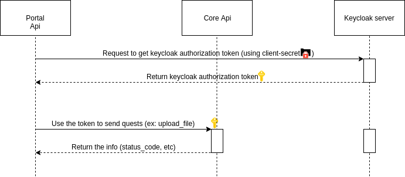

# VDX Helper
This repository provides a wrapper for every call from Portal to Core Api and is called vdx-helper.
In other words, when working with Portal Api, the need of interaction with Core Api to manipulate database
## How it works
This helper first needs to be authorized by wielding valid token from Keycloak, then use that token for further requests as long as it has not expired.
Each method also allows one to include their own custom mappers in, enabling the method to return the result in the format the user wishes


## Prerequisites

- Python poetry
- Docker + docker-compose

## Usage

### Initialization

Required parameters: 
- url: The url leading to Core Api server
- keycloak_url: The url leading to keycloak server
- core_api_key: client secret from keycloak (reference here: https://bitbucket.org/morphoVDX/keycloak-admin-client-python/pull-requests/2/feature-vdx-502-docker-config/diff#chg-README.md)
- core_api_client_id: client id


```
vdx_helper = VDXHelper(url='http://vizidox-core-api.com', keycloak_url='http://keycloak.com', core_api_key=here_is_the_client_secret, core_api_client_id=here_is_the_client_id)
```

### Mapper example
A mapper will receive a json-formatted parameter as their input. The following example mapper will add an additional field

```
def example_mapper(json_file):
    returned_json = copy.deepcopy(json_file)
    returned_json['additional_field'] = 'additional_value'
    return returned_json

```

### Usage example

```
vdx_helper.upload_file(file=the_file_to_upload, mapper=example_mapper)
```

## Running the tests

Set up a container with the attached *Dockerfile* and run the line below within the container

```
python -m tests
```

### Run the test locally with docker-compose step-by-step
1. Turn up the docker-containers
```
docker-compose up -d
```
2. Open an interactive bash shell inside the container containing the api as well as unittests
```
docker exec -it local_api bash
```
3. Once we are inside the container, run the code below to run unittests
```
python -m tests
```
 
## Authors

* **Tiago Santos** - *Initial work* - [Vizidox](https://vizidox.com)
* **Sara Pereira** - *Corrections and improvements* - [Vizidox](https://vizidox.com)
* **Lê Hồng Hiếu** - *Library definition* - [Vizidox](https://vizidox.com)
## License

All of the code developed in this project belongs to Vizidox Solutions Limited under the ownership of Freddy Elturk and 
any distribution or use must be authorized and agreed upon previously.
